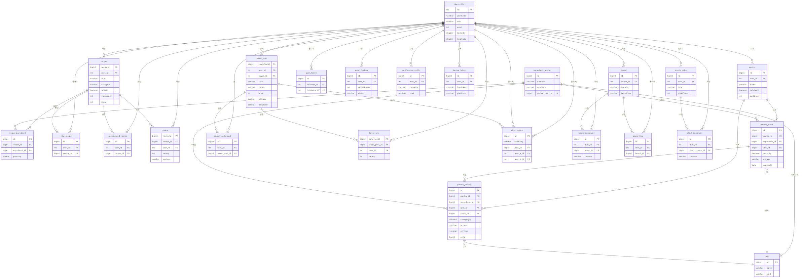

# CookAndShare (CNS) - Backend
> **레시피 공유 및 위치 기반 주방용품 공유 플랫폼**
---
**안내 사항**
이 레포지토리는 팀 졸업작품인 CookAndShare의 백엔드(Spring Boot) 파트를 리팩토링하기 위해 분리한 프로젝트입니다.
* **원본 팀 프로젝트 레포지토리**: [https://github.com/shangpa/CnsSpring]
* **주요 변경 사항**: 기존 코드를 베이스로 성능 개선(비동기 처리 등), 예외 처리, 코드 아키텍처 개선을 지속적으로 진행하고 있습니다.
---
  
## System Architecture & DB Design

- **보안**: JWT를 활용한 Stateless 인증 체계 구축

## Tech Stack
- **Language**: Java 17
- **Framework**: Spring Boot 3.4.1
- **Database**: MySQL
- **Auth**: JWT (JSON Web Token)
- **External API**: OpenAI API (이미지 생성),Google Cloud Vision, Google Translate API

## 주요 기능 
- **AI로 레시피 썸네일 생성**: OpenAI API를 연동하여 텍스트 기반 레시피의 썸네일 생성
- **스마트 냉장고 관리**: Google Vision API를 활용한 영수증/이미지 분석 및 식재료 자동 등록 시스템
- **위치 기반 '동네주방'**: 유저 위치 데이터를 활용한 주변 이웃 간 식재료 거래 및 실시간 채팅 서비스
- **미디어 자원 관리**: UUID 기반 파일명 정책을 통한 보안성 확보 및 이미지/동영상 업로드 최적화

## 성능 개선 및 트러블슈팅 (Troubleshooting)
### 1. 외부 API 연동 지연 문제 개선 (진행 중)
- **문제**: 레시피 작성 시 외부 API(번역 + 이미지 생성) 호출 완료 후 레시피 작성완료까지 약 20초 이상의 대기 시간 발생
- **해결 방안**:
    - Spring **`@Async`**를 도입하여 레시피 기본 정보를 우선 DB에 저장 후 즉시 응답 반환
    - 이미지 생성은 별도에서 백그라운드로 실행하여 사용자 체감 속도 개선 시도

## Project Structure
본 프로젝트는 유지보수와 확장성을 위해 **도메인 중심(Domain-Driven)** 패키지 구조를 사용하였습니다.
### Domain Packages
* **`admin`**: 관리자 전용 기능 (통계, 로깅, 서비스 관리)
* **`auth` / `jwt`**: OAuth2 기반 인증 및 JWT 보안 토큰 처리
* **`recipe`**: 핵심 비즈니스 (레시피 생성, 조회)
* **`user`**: 사용자 프로필 및  데이터 관리
* **`ingredient`**: 식재료 데이터베이스 및 재고 관리

### Infrastructure & Tools
* **`api`**: 외부 서비스 연동 (OpenAI, Google Vision/Translate) 및 API Quota 관리
* **`config`**: Security, Firebase, WebSocket 등 시스템 전역 설정
* **`util`**: 거리 계산, 키 생성 등 공통 유틸리티

* [발표 PPT 다운로드 (PDF)](./readme/cns.pdf)
