# CookAndShare (CNS) — Backend

> **레시피 공유 및 위치 기반 식재료 거래 플랫폼 백엔드**

---

**안내 사항**
이 레포지토리는 팀 졸업작품 CookAndShare의 백엔드(Spring Boot) 파트를 개인적으로 리팩토링한 프로젝트입니다.

- **원본 팀 프로젝트 레포지토리**: [https://github.com/shangpa/CnsSpring]
- **리팩토링 목적**: 보안 취약점 제거, 예외 처리 중앙화, SRP 적용, 테스트 코드 도입

---

## System Architecture & DB Design

> 레거시(`fridge`, `fridge_history`)·유틸(`search_keyword`, `admin_log`) 테이블 제외, 도메인별로 분리하여 표시

### 사용자 도메인


### 레시피 도메인


### 팬트리 도메인 (식재료 관리)


### 거래 · 채팅 도메인


### 커뮤니티 도메인


- **인증**: JWT Stateless 인증 (Spring Security 6)
- **실시간**: WebSocket (STOMP) 기반 채팅
- **알림**: Firebase FCM 푸시 알림

---

## Tech Stack

| 분류 | 기술 |
|------|------|
| Language | Java 17 |
| Framework | Spring Boot 3.4.1 |
| Security | Spring Security 6, JWT |
| Persistence | Spring Data JPA, MySQL |
| Messaging | WebSocket (STOMP) |
| Notification | Firebase FCM |
| External API | OpenAI API (이미지 생성, 데모 환경에서는 비용 절감을 위해 비활성화), Google Cloud Vision, Google Translate API |
| Docs | Springdoc OpenAPI (Swagger UI) |
| Infra | Docker, docker-compose, OCI ARM VM (Always Free) |
| CI/CD | GitHub Actions |

---

## Getting Started

### 1. 환경변수 설정

`src/main/resources/application-local.properties.example`을 복사하여 `application-local.properties`를 만들고 값을 채웁니다.

```properties
# Database
DB_URL=jdbc:mysql://localhost:3306/cns?serverTimezone=UTC&characterEncoding=UTF-8
DB_USERNAME=root
DB_PASSWORD=your_password_here

# JWT
JWT_SECRET=your_jwt_secret_here

# Google API
GOOGLE_API_KEY=your_google_api_key_here
```

추가로 필요한 파일:

| 파일 | 설명 |
|------|------|
| `src/main/resources/gcp-key.json` | Google Cloud Vision 서비스 계정 키 |
| `src/main/resources/api.properties` | OpenAI API 키 (`api.properties.example` 참고) |
| Firebase Admin SDK JSON | `config/FirebaseConfig.java` 경로 확인 |

### 2. 로컬 실행

```bash
# Gradle Wrapper로 실행
./gradlew bootRun

# 또는 빌드 후 실행
./gradlew build
java -jar build/libs/cns-backend-*.jar
```

### 3. API 문서 (Swagger UI)

서버 실행 후 브라우저에서 접속:

```
http://localhost:8080/swagger-ui/index.html
```

---

## Deployment (OCI + Docker)

Oracle Cloud Infrastructure ARM VM (Always Free) 위에 Docker Compose로 배포

main 브랜치에 push하면 GitHub Actions가 자동으로 서버에 배포

### 서버 구성

| 항목 | 내용 |
|------|------|
| 서버 | OCI ARM A1 VM (Ubuntu 22.04, 4 OCPU / 24GB RAM) |
| 컨테이너 | Docker + docker-compose |
| 앱 | Spring Boot (`:8080`) |
| DB | MySQL 8.0 (컨테이너, VM 내부 전용) |
| CI/CD | GitHub Actions — main push 시 자동 배포 |

### CI/CD 흐름

```
git push → main
    ↓ GitHub Actions 자동 실행
SSH → OCI VM → git pull → docker-compose up --build
```

### 환경변수 (VM의 .env)

서버에는 `.env` 파일을 직접 생성 (Git에 포함되지 않음)

| 변수 | 설명 |
|------|------|
| `DB_PASSWORD` | MySQL root 패스워드 |
| `JWT_SECRET` | JWT 서명 키 (256bit 이상 랜덤 문자열) |
| `GOOGLE_API_KEY` | Google Cloud Vision / Translate |
| `OPENAI_API_KEY` | OpenAI 이미지 생성 (비용 문제로 현재 비활성화, 키 등록 시 즉시 활성화) |

시크릿 파일은 별도로 VM에 직접 복사:
- `src/main/resources/gcp-key.json`
- `src/main/resources/firebase/serviceAccountKey.json`
- `src/main/resources/api.properties`

---

## 주요 기능

- **AI 레시피 썸네일 생성**: OpenAI API + `@Async` 비동기 처리 → 레시피 저장 즉시 응답, 이미지는 백그라운드 생성 (데모 환경에서는 API 비용 절감을 위해 비활성화, 키 등록 시 즉시 활성화)
- **스마트 식재료 인식**: Google Vision API로 영수증/이미지를 분석하여 식재료 자동 등록
- **위치 기반 동네주방**: 이웃 간 식재료 거래 + WebSocket(STOMP) 실시간 채팅
- **Firebase 푸시 알림**: 거래 요청 등 이벤트 발생 시 FCM 알림 발송
- **표준 재료 관리**: `IngredientMaster` 기반으로 재료 동의어("달걀"/"계란")를 표준 ID로 통일

---

## 리팩토링 내역

팀 프로젝트 종료 후 코드베이스를 독립적으로 검토하여 문제를 발견하고 10개 커밋으로 개선했습니다.

| # | 커밋 | Before                                 | After |
|---|------|----------------------------------------|-------|
| 1 | 보안 자격증명 분리 + 전역 예외 처리 | DB 비밀번호·JWT Secret 하드코딩, 컨트롤러별 try-catch | 환경변수 분리(`application-local.properties`), `GlobalExceptionHandler` 중앙화 |
| 2 | 콘솔 로그 → SLF4J 전환 | `System.out.println`으로 비밀번호 콘솔 노출      | SLF4J 로거 교체, 민감 정보 로깅 제거 |
| 3 | API 엔드포인트 RESTful 전환 | `/getRecipe`, `/deleteRecipe` 등 동사형 URL | `/recipes`, `/recipes/{id}` HTTP 메서드 활용 |
| 4 | 트랜잭션 + 입력값 검증 | 조회 메서드에 `readOnly` 미설정, `@Valid` 누락    | `@Transactional(readOnly=true)` 적용, `@Valid` + BindingResult 추가 |
| 5 | 매직 넘버 → Enum | `status = 0/1/2` 숫자로 거래 상태 관리          | `TradeStatus.AVAILABLE / RESERVED / COMPLETED` Enum 도입 |
| 6 | Fridge 레거시 처리 | 구버전 FridgeController 존재                | `@Deprecated` 마킹, Pantry 도메인으로 이관 방향 명시 |
| 7 | RecipeService → RecipeDraftService 분리 | RecipeService 21개 메서드, 임시저장 로직         | SRP 적용, 임시저장 로직만 담당하는 `RecipeDraftService` 분리 |
| 8 | RecipeService → RecipeStatService 분리 | 조회수·좋아요 통계 로직이 핵심 서비스에 혼재              | `RecipeStatService`로 분리, 각 서비스 응집도 향상 |
| 9 | 단위 테스트 추가 (Mockito) | 테스트 코드 0개                              | `RecipeService`, `RecipeDraftService` 단위 테스트 (Mockito) |
| 10 | 통합 테스트 추가 (@WebMvcTest) | 구조 변경 후 수동 확인                          | `RecipeStatService`, `RecipeController`, `GlobalExceptionHandler`, `JWTUtil` 테스트 — 총 5파일 16케이스 |

---

## 성능 개선 및 트러블슈팅

### 1. 외부 API 연동 지연 문제 (`@Async`)

- **문제**: 레시피 작성 시 번역 + OpenAI 이미지 생성 호출이 순차적으로 실행되어 응답까지 20초 이상 대기
- **해결**: `@Async` 도입으로 레시피 기본 정보 DB 저장 후 즉시 응답, 이미지 생성은 별도 스레드에서 백그라운드 실행
- **결과**: 사용자 체감 응답 시간 20초 → 즉시 반환

### 2. Spring Security 6 + `@WebMvcTest` 인증 문제

- **문제**: STATELESS 세션 정책 환경에서 `@WebMvcTest`에 `authentication()` 포스트프로세서를 적용해도 SecurityContext가 인식되지 않아 모든 테스트 요청이 403 반환
- **원인**: `@WebMvcTest`는 Security 자동 설정을 슬라이스로 로딩하는데, 운영 `SecurityConfig`의 세션 정책(STATELESS)이 테스트 세션을 차단
- **해결**: `@WebMvcTest(excludeAutoConfiguration = SecurityAutoConfiguration.class)` + 테스트 전용 `TestSecurityConfig`를 `@Import`하여 테스트에서만 permitAll 정책 적용

### 3. 재료 동의어 문제 — `IngredientMaster` 도입 (도메인 설계)

- **문제**: `Fridge`에서 재료를 `String`으로 저장하면 "달걀" / "계란" / "달걀(대)"가 모두 다른 재료로 인식 → 레시피 완성 후 재료 자동 차감 불가
- **해결**: `IngredientMaster` 엔티티로 표준 재료 목록을 관리하고, `Pantry`가 표준 재료 ID(`ingredientMasterId`)로 저장하도록 구조 변경 → 동의어 없이 정확한 비교·차감 가능
- **효과**: 재료 등록 시 자동완성 기반 표준화, 레시피 완성 후 식재료 자동 차감 기능 구현 기반 마련

---

## Project Structure

도메인 중심(Domain-Driven) 패키지 구조를 사용합니다.

```
src/main/java/com/example/cns/
├── admin/          관리자 전용 (통계, 로깅, 서비스 관리)
├── api/            외부 서비스 연동 (OpenAI, Google Vision/Translate)
├── auth/           OAuth2 인증 처리
├── jwt/            JWT 발급·검증
├── config/         전역 설정 (Security, Firebase, WebSocket, Swagger)
│
├── recipe/         레시피 핵심 (RecipeService / RecipeDraftService / RecipeStatService)
├── recipeingredient/ 레시피-재료 연결
├── ingredient/     IngredientMaster (표준 재료 마스터)
├── pantry/         식재료 관리 (Fridge 리팩토링 후 이관)
├── fridge/         [레거시, @Deprecated] 구버전 식재료 관리
│
├── board/          자유 게시판
├── shorts/         숏폼 영상
├── tradepost/      동네주방 거래 게시물 (TradeStatus Enum)
├── chat/           실시간 채팅 (WebSocket/STOMP)
├── notification/   Firebase FCM 푸시 알림
│
├── User/           사용자 계정
├── profile/        숏폼(팔로워, 팔로잉) 프로필
├── mypage/         마이페이지
├── point/          포인트 시스템
├── review/         리뷰(레시피,거래글)
├── report/         신고
├── search/         검색
│
├── image/          이미지 업로드 (UUID 기반 파일명 정책)
├── common/         공통 컴포넌트 (GlobalExceptionHandler 등)
└── util/           공통 유틸리티 (거리 계산, 키 생성 등)
```

---

[발표 PPT 다운로드 (PDF)](./readme/cns.pdf)
