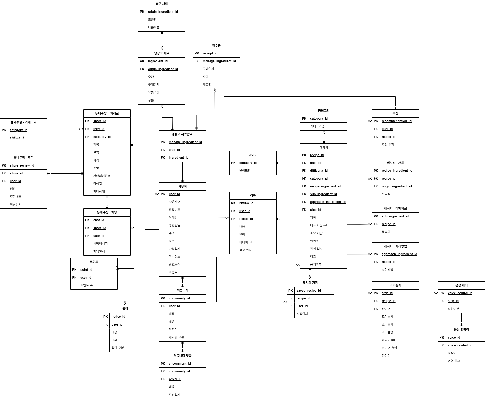

## 🛠 Tech Stack
- **Language**: Java 17
- **Framework**: Spring Boot 3.4.1
- **Database**: MySQL
- **Auth**: JWT (JSON Web Token)
- **External API**: OpenAI API (이미지 생성), Google Translate API

## 📌 핵심 기능
- **AI 레시피 이미지 생성**: 사용자의 입력 키워드를 바탕으로 OpenAI API를 연동하여 레시피의 이미지 생성
- **사용자 인증**: JWT를 활용한 보안 로그인 및 권한 관리
- **미디어 관리**: UUID 기반 파일명 정책을 통한 이미지/동영상 업로드 및 관리

## 🏗 System Architecture & DB Design

## 🚀 고도화 및 성능 개선 (Troubleshooting)
### 1. 외부 API 연동 지연 문제 개선 (진행 중)
- **문제**: 레시피 생성 시 번역 및 이미지 생성 API 호출이 완료될 때까지 사용자가 대기해야 하는 현상 발생 (평균 10초 이상)
- **해결**: Spring `@Async`를 도입하여 레시피 정보 우선 저장 후, 이미지는 백그라운드에서 비동기로 생성하도록 구조 개선 예정

## 📂 Project Structure
src/main/java/com/cns/
├── admin/             # 관리자 전용 기능 (DTO, Enums, Logging, Service/Controller)
├── auth/              # 인증/인가 컨트롤러 및 구글 토큰 검증 유틸
├── recipe/            # 레시피 생성, 조회 및 관리 (Controller, Service, Repository, Entity)
├── user/              # 사용자 정보 및 프로필 관리 (Controller, Service, Repository, Entity)
├── ingredient/        # 식재료 데이터 관리 (Controller, Service, Repository, Entity)
├── [기타 도메인]/       # 기타 기능별 도메인 패키지 (폴더 구조 동일)
├── api/                   # 외부 API 연동 모듈 (Infrastructure Layer)
│   ├── openai/            # OpenAI API (레시피 이미지 생성)
│   ├── vision/            # Google Cloud Vision API 연동
│   ├── translate/         # Google Translation API 연동
│   └── ApiUsageLimiter    # API 호출량 제한 로직 (비용 및 성능 관리)
├── jwt/                   # JWT 보안 핵심 로직 (Filter, Util, Login logic)
├── config/                # 시스템 전역 설정 (Security, Firebase, WebSocket, Web 등)
└── util/                  # 공통 유틸리티 (DistanceUtil, KeyGenerator 등)
